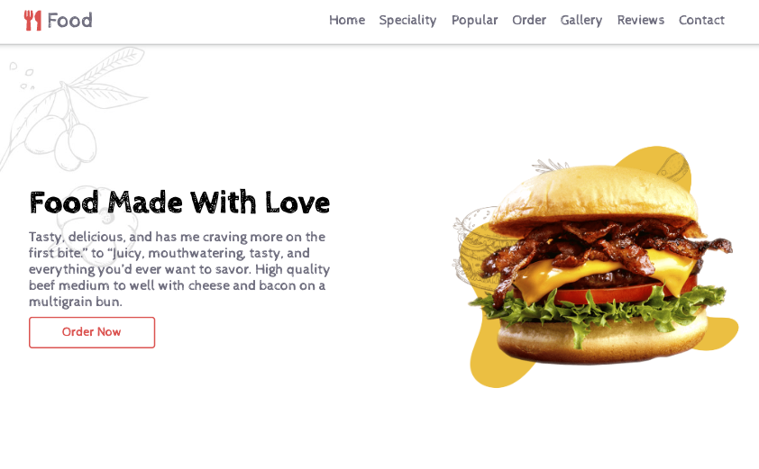

# Food Website

This repository contains the code for a food website,inspired by the design of Mr. Web Designer[https://www.buymeacoffee.com/mrwebdesigner]. The website showcases various food items and provides information about the food menu, popular foods, special foods and ordering options.

## Acknowledgements

I would like to express my gratitude to Mr. Web Designer for providing the design idea and the links to the assets that served as the inspiration for this project. The design elements and visual style greatly influenced the development of this website.

- YouTube Channel: [Mr. Web Designer](https://www.youtube.com/@MrWebDesignerAnas)

The following assets were utilized in this project:

- Google Fonts: https://fonts.google.com/
- React Icons: [Icon source](https://react-icons.github.io/react-icons/)
- Images: [Image source](https://www.freepik.com/)

## Features

- Browse through a visually appealing collection of food items.
- Access detailed information about each food item, including descriptions and nutritional information, time for the preparationa and ratings.
- Place orders for food items through the website.
- Responsive design, ensuring optimal viewing experience on different devices.

## Technologies Used

- HTML
- CSS
- React
- CRA(Create React App)

## Getting Started

To run the food website locally, follow these steps:

1. Clone the repository: `git clone https://github.com/pradeepkhanal23/Food-website.git`
2. Navigate to the project directory: `cd Food-website`
3. Open the `index.html` file in your web browser.

## Usage

1. Open the website in your browser.
2. Browse through the food items by navigating the menu.
3. Click on a food item to view more details, including descriptions and images, and how to order them.
4. Explore the popular and special section to discover various options and special deals.
5. Place an order for your desired food items using the provided ordering options.

## License

This project is licensed under the [MIT License](LICENSE).

## Contact

If you have any questions or suggestions, feel free to reach out to the project maintainer.

## Live Demo

https://restaurant-website-pradeep.netlify.app/
